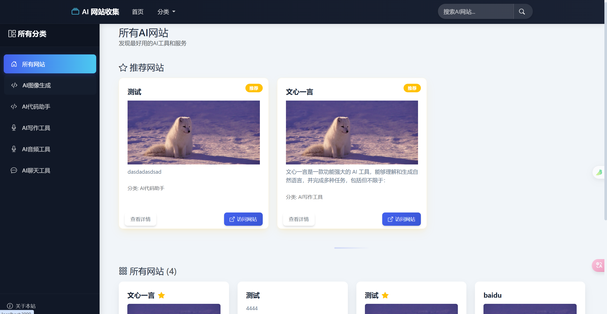
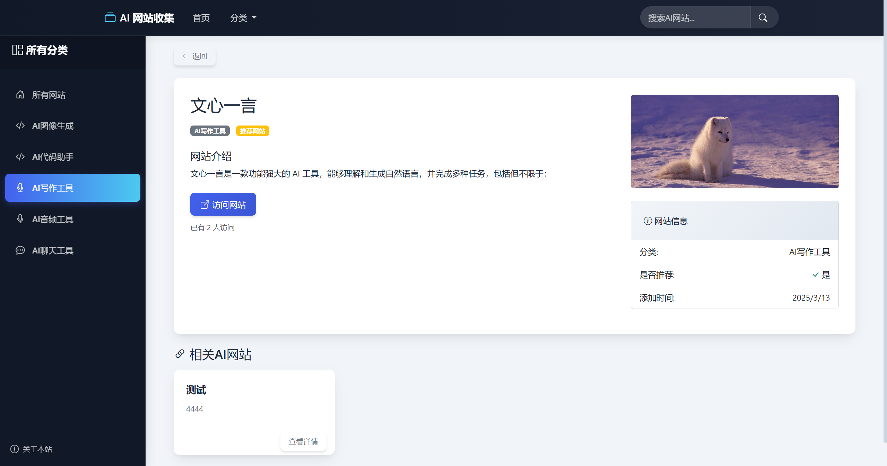
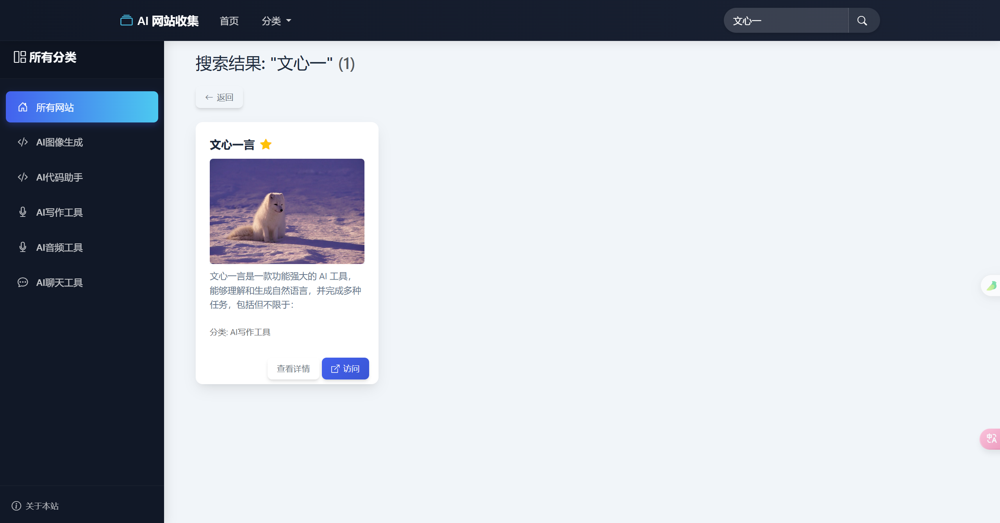
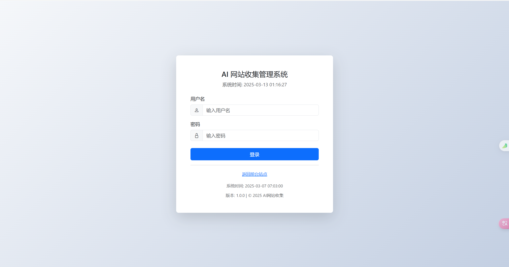
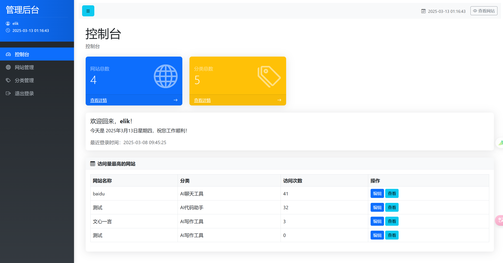
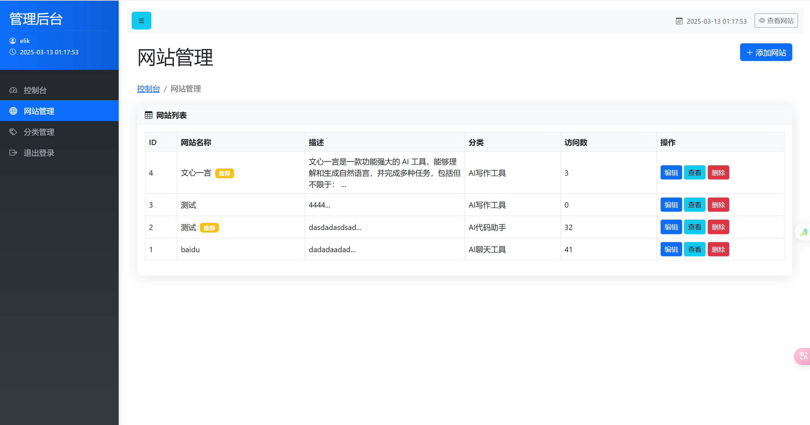
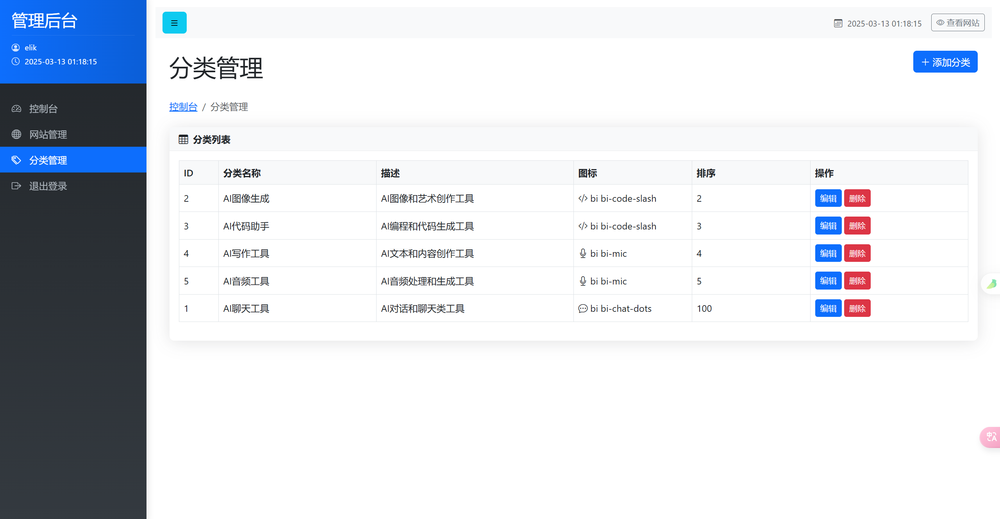

# AI网站收集整理平台

这是一个用于收集、整理和展示AI相关网站的平台，提供了前台展示和后台管理功能。

## 功能特点

- 前台展示AI网站列表，支持分类浏览
- 网站详情页展示，包含网站描述、链接和相关推荐
- 网站搜索功能
- 后台管理系统，支持网站和分类的增删改查
- 响应式设计，适配各种设备

## 技术栈

- Node.js + Express.js：后端框架
- EJS：模板引擎
- MySQL：数据库
- Express-session：会话管理
- Multer：文件上传处理
- Bcrypt：密码加密
- 原生JavaScript + CSS：前端开发

## 安装说明

### 前提条件

- Node.js (v12+)
- MySQL 数据库

### 安装步骤

1. 克隆或下载项目代码

2. 安装依赖包
   ```
   npm install
   ```

3. 创建MySQL数据库
   - 创建名为`ai_websites`的数据库
   - 导入项目提供的SQL文件（如果有）或手动创建以下表：
     - `websites`：存储网站信息
     - `categories`：存储分类信息
     - `admins`：存储管理员信息

4. 配置环境变量
   - 复制`.env.example`文件（如果有）为`.env`，或创建新的`.env`文件
   - 配置以下环境变量：
   ```
   DB_HOST=localhost
   DB_USER=你的数据库用户名
   DB_PASSWORD=你的数据库密码
   DB_NAME=ai_websites
   SESSION_SECRET=你的会话密钥
   PORT=3000
   ```

5. 启动应用
   ```
   npm start
   ```
   或开发模式启动：
   ```
   npm run dev
   ```

6. 访问应用
   - 前台：http://localhost:3000
   - 后台：http://localhost:3000/admin

## 使用指南

### 前台功能

1. **首页浏览**
   - 访问首页可查看所有AI网站列表
   - 顶部展示推荐网站
   - 通过导航栏可按分类浏览网站

2. **网站详情**
   - 点击网站卡片可查看网站详细信息
   - 详情页显示网站描述、链接和相关推荐

3. **搜索功能**
   - 使用顶部搜索框可搜索网站

### 后台管理

1. **登录**
   - 访问`/admin/login`进入登录页面
   - 输入管理员账号密码登录

2. **网站管理**
   - 查看所有网站列表
   - 添加新网站：填写标题、描述、URL、上传图片等
   - 编辑现有网站信息
   - 删除网站

3. **分类管理**
   - 查看所有分类
   - 添加新分类
   - 编辑分类名称和排序
   - 删除分类

## 界面展示

### 前台界面

#### 首页


#### 网站详情页


#### 搜索结果页


### 后台管理界面

#### 管理员登录


#### dashboard


#### 网站管理


#### 分类管理


## 项目结构

```
├── app.js              # 应用入口文件
├── controllers/        # 控制器
│   ├── adminController.js
│   ├── categoryController.js
│   └── websiteController.js
├── models/             # 数据模型
│   ├── category.js
│   ├── database.js
│   └── website.js
├── public/             # 静态资源
│   ├── css/
│   ├── images/
│   ├── js/
│   └── uploads/        # 上传的图片
├── routes/             # 路由
│   ├── admin.js
│   ├── index.js
│   └── websites.js
├── views/              # 视图模板
│   ├── admin/          # 后台视图
│   ├── layouts/        # 布局模板
│   └── ...其他视图文件
├── .env                # 环境变量
└── package.json        # 项目配置
```

## 开发与扩展

### 添加新功能

1. 在相应的控制器中添加新方法
2. 在路由文件中定义新路由
3. 创建或修改相应的视图模板

### 自定义样式

- 前台样式：修改`public/css/style.css`
- 后台样式：修改`public/css/admin.css`

## 许可证

[MIT](LICENSE)